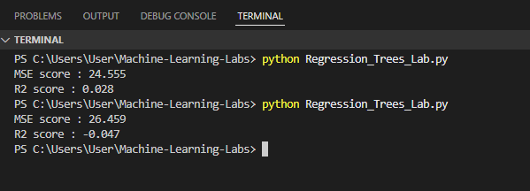

# Machine-Learning-Labs

Lab work for machine learning models.

## Regression Tree Lab

This lab demonstrates the use of regression trees to predict tip amounts from a taxi dataset. The analysis includes feature selection, model evaluation, and parameter tuning.
This lab demonstrates the use of regression trees to predict tip amounts from a taxi dataset. The analysis includes feature selection, model evaluation, and parameter tuning.

### Installation

Make sure you have the required Python packages installed. You can install them using:

```bash
from __future__ import print_function
import numpy as np
import pandas as pd
import matplotlib.pyplot as plt

from sklearn.model_selection import train_test_split
from sklearn.preprocessing import normalize
from sklearn.metrics import mean_squared_error
from sklearn.tree import DecisionTreeRegressor
```

### Imports

Add these imports at the top of your Python script:

```python
import pandas as pd
import numpy as np
from sklearn.tree import DecisionTreeRegressor
from sklearn.model_selection import train_test_split
from sklearn.metrics import mean_squared_error, r2_score
import matplotlib.pyplot as plt
import seaborn as sns
```

### Correlation Analysis

We first examine the correlation between each feature and the target variable (`tip_amount`). The top three features most correlated with tip amount are identified using:


**Finding:**  
Fare amount, toll amount, and trip distance are the top features affecting the tip amount, which makes logical sense.

### Feature Removal Effect

Next, we remove four features that are not correlated with the target variable to observe their effect on model performance:

```python
raw_data = raw_data.drop(['payment_type', 'VendorID', 'store_and_fwd_flag', 'improvement_surcharge'], axis=1)
```

After removing these features, we re-run the regression tree and evaluate the Mean Squared Error (MSE) and R² values.

**Finding:**  
The MSE and R² values do not change significantly, showing that these parameters have minimal effect on the final regression output.

---

### Effect of max_depth=4

We then decrease the `max_depth` parameter of the regression tree to 4 and observe the effect on model performance.

**Finding:**  
The MSE value decreases and the R² value increases, indicating that a `max_depth=4` may be more suitable for this dataset.


### Effect of max_depth=12

We also test the regression tree with `max_depth=12` to observe its impact on model performance.

**Finding:**  
MSE is noted to be increased by increasing the max_depth of the tree. This may be because of the model having excessive parameters, causing it to overfit the training data and perform worse on the testing data. Another important observation is that the model gives a negative value of R², indicating that the prediction model does a very poor job of predicting the values on a test set.


